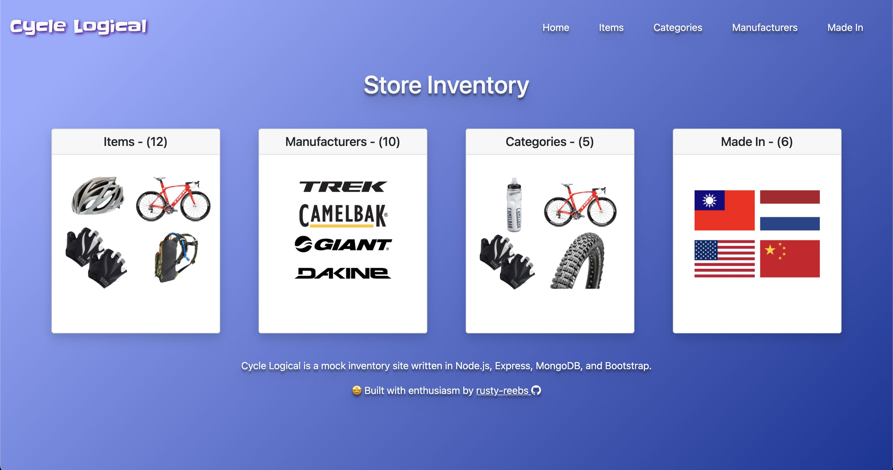
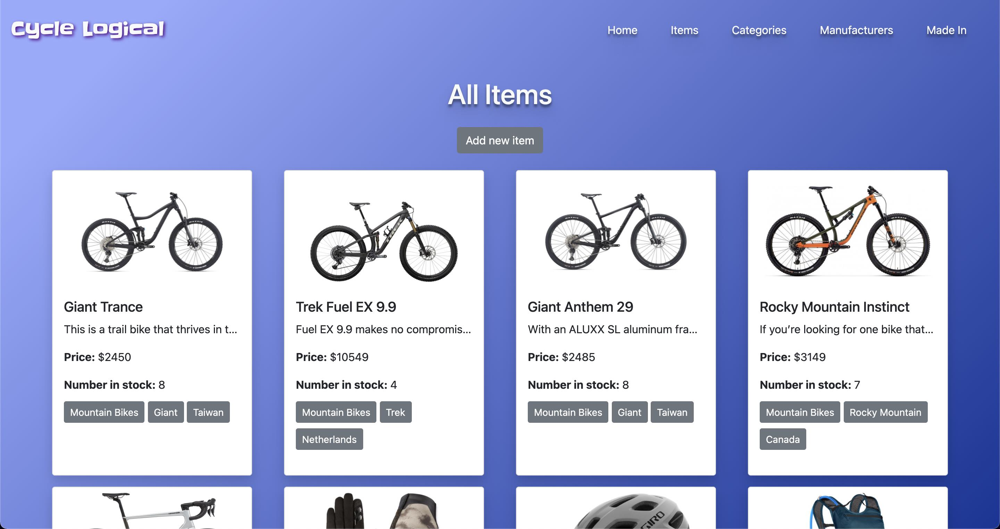
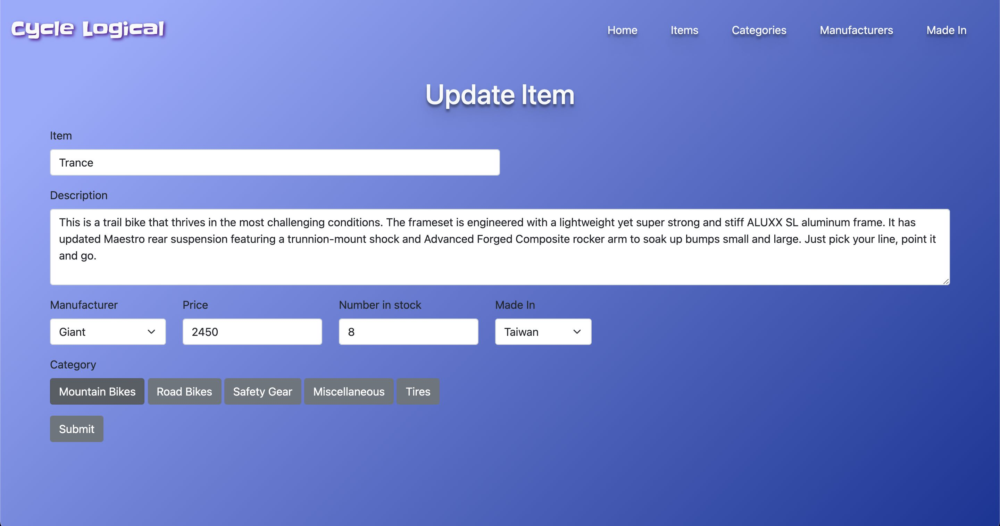
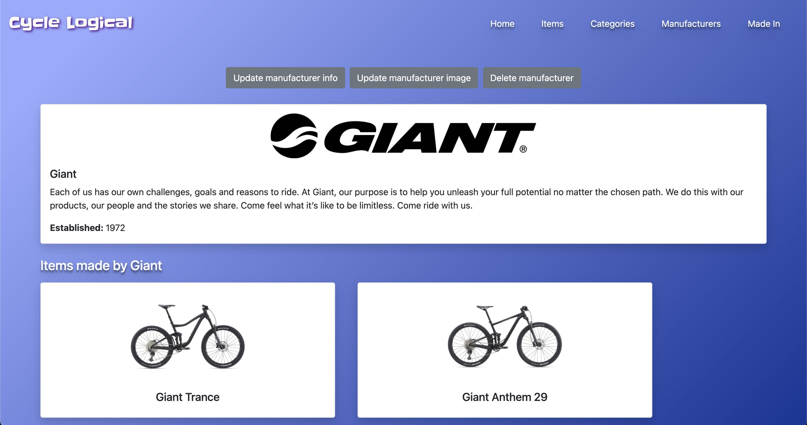

# Store inventory CRUD app

&nbsp;&nbsp;&nbsp;&nbsp;  

Date completed: January 29, 2022  

**Optimized for 📱 mobile and 🖥 desktop!**  

**See it live at (https://crud-app-rusty-reebs.herokuapp.com)**  

Objectives: Build a CRUD inventory management app utilizing MVC -- models, views and controllers.  

### Screenshots
----

&nbsp;&nbsp;  

&nbsp;&nbsp;  

### TIL Things I Learned
----

- how to develop an Express app featuring common database operations like create, read, update and delete.
- how to design a backend app with the model, view, controller (MVC) pattern.
- one of the challenges in this project was figuring out how to upload/delete images with the Cloudinary API.
- also learned a ton about EJS templating!